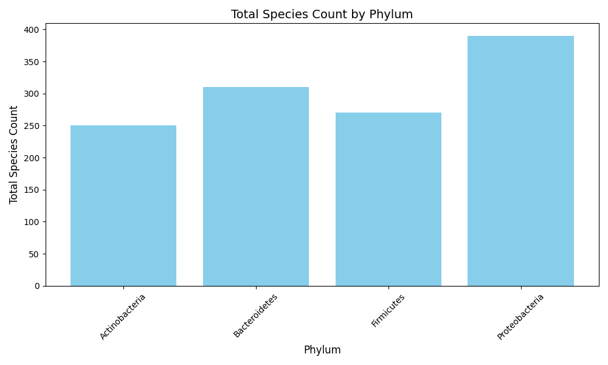

## Taxonomic Data Analysis Script and Docker


### Author

**Anestis Gkanogiannis**  
Email: anestis@gkanogiannis.com

---

### **Overview**

This Python script processes taxonomic species data and provides:

1. **Summary Statistics**:
   - Calculates the total and average species count per taxonomic phylum.
2. **Data Export**:
   - Saves the summary results in a CSV file.
3. **Visualization**:
   - Generates a bar chart illustrating the total species count for each phylum.

It can be run as:
   - Standalone python script
     - `python3 taxonomic_stats.py ...`
     - This method requires to be installed `python>=3.12` and all modules in the `requirements.txt`.
   - Docker image, through helper script
     - `bash taxonomic_stats.sh ...`
     - This method only requires `docker`.

---

### **Features**

- **Input**:
  - Accepts a CSV file with the following structure:
    ```
    species,phylum,count
    SpeciesA,Firmicutes,120
    SpeciesB,Firmicutes,80
    ```
- **Output**:
  - A CSV file summarizing total and average species counts (default `phylum_summary.csv`).
  - A bar chart showing total species counts per phylum (default `phylum_species_count.png`).

---

### **Usage**

1. **Prepare the Input File**:

   - Ensure your CSV file follows the format:
     ```
     species,phylum,count
     SpeciesA,Firmicutes,120
     SpeciesB,Firmicutes,80
     ```

2. **Run docker image with the Helper Script**:
   
   A bash wrapper script, that dynamically creates volume mounts (based on the provided arguments) and runs the `gkanogiannis/taxonomic_stats` docker image.

   ```bash
   bash taxonomic_stats.sh -i input_file -o output_file -p output_plot
   ```

   - If no arguments are provided, then the script will use `taxonomic_data.csv` as input, `phylum_summary.csv` and `phylum_species_count.png` as outputs in the current directory.
   - If `input_file` is provided but no `output_file` and/or `output_plot`, they are generated in the same location as the `input_file`.

3. **Check Outputs**:
   - `phylum_summary.csv`: Contains summary statistics.
   - `phylum_species_count.png`: Bar chart visualizing total species counts.

---

### **Example Output**

#### **CSV File (`phylum_summary.csv`)**

| phylum         | total_species_count | average_species_count |
| -------------- | ------------------- | --------------------- |
| Actinobacteria | 250                 | 125.0                 |
| Bacteroidetes  | 310                 | 103.33                |
| Firmicutes     | 270                 | 90.0                  |
| Proteobacteria | 390                 | 195.0                 |

#### **Bar Chart (`phylum_species_count.png`)**

A bar chart with the x-axis representing phyla and the y-axis showing the total species count.



---

### **Testing**

To run unit tests:

```bash
python -m unittest test_taxonomic_stats.py
```

---

### **License**

This project is licensed under the MIT License. See the [LICENSE](LICENSE) file for details.

---
